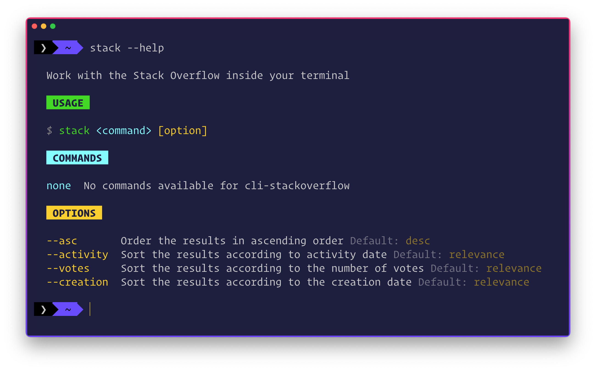

<div align="center">
	<b>Search any query on Stack Overflow without leaving your IDE</b>
	<br>
	
	
	
</div>

# 💥 stackoverflow-cli

- Search any query inside your terminal
- Top 10 threads
- Order the results in ascending/descending order
- Sort the results via relevance/votes/activity/creation

## ↓ INSTALL

```sh
# install the cli globally
npm i -g cli-stackoverflow

# use it via npx
npx cli-stackoverflow
```

## ⚡️ USAGE

You can run the CLI by executing following commands inside the terminal:

```sh
stack
```

### 📃 Guide

- <kbd>Right →</kbd> key – Next thread
- <kbd>Left ←</kbd> key – Prev thread
- <kbd>Up ↑</kbd> key – Next Answer
- <kbd>Down ↓</kbd> key – Prev Answer


### 🏳 Flags

```sh
# CLI help
stack --help
```



```sh
# Order results in ascending order
stack --asc

# Sort results according to the most activity
stack --activity

# Sort results according to  votes
stack --votes

# Sort results according to the creation
stack --creation
```


## 👨🏻‍💻 CONTRIBUTORS

- [Saad Irfan](https://github.com/msaaddev)
- [Aneesh Kodali](https://github.com/aneeshkodali)
- [Angelina Gasharova](https://github.com/angelinag)

## 🔑 LICENSE

- MIT
